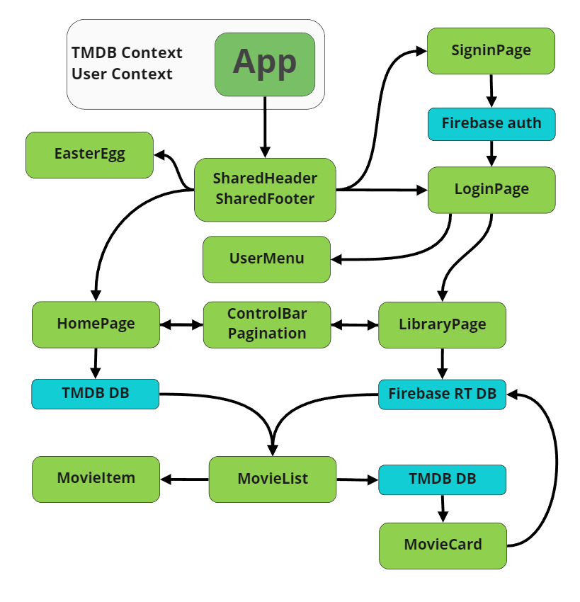
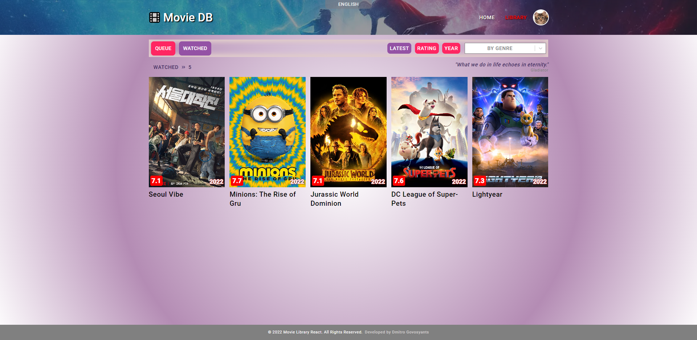
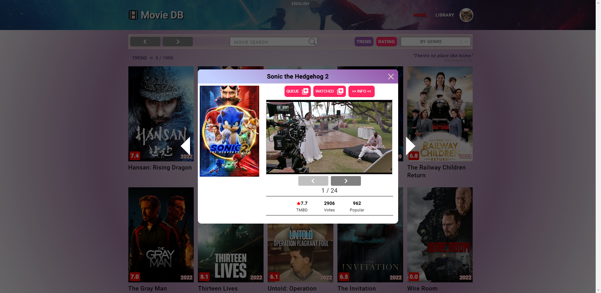
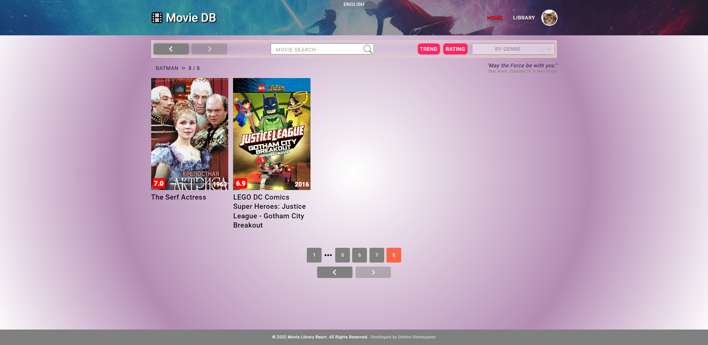

**Read documentation in other languages: [Русский](README.ru.md)**

**Read deploy documentation: [Delpoy](README.deploy.md).**

# Movie Library App. React.js.

## Сore functionality

- View movies list from the TMDB database
- View movie info
- Watching teasers and trailers of the movie
- Sorting by trend and rating
- Filtering by Genre
- Search movie by title
- Custom Pagination
- Custom Swipe for Mobile devices
- Localization of the TMDB base
- Easter Egg

## Authorization functionality

- Access to personal movie library
- Add movies to the lists "Queue" and "Watched"
- Sorting library by View List
- Sorting the library by latest added, rating, release date
- Filtering library by genre
- User Menu

## UX/UI

- Saving user requests in the URL query string
- History of queries is saved between pages
- Private and public routes
- Application status control menu is placed in a neat block
- Additional pagination at the top of the page
- "Breadcrumbs" to review the current state of the app
- "Skeleton" movie list when uploading posters
- Swipe movie cards on Mobile devices
- Switching movie cards on Desktop devices
- "Space" Loader when uploading content
- Change of user avatars with saving in DB
- Always current year of the app in the footer
- Adaptive and responsive design for all devices from 320px
- Popup messages Interaction with user
- Selected size of buttons for different screens
- Readable text for different devices
- Useful links in the user menu
- Favicons for different devices
- Additional cursors
- Soft gradients and shadows
- Localization
- Movie Quotes
- Easter Egg

## App view

## API

- Firebase auth
- Firebase Realtime DB
- TMDB DB

## Dependencies

- react
- react-router-dom
- react-hook-form
- react-select
- react-icons
- react-toastify
- react-loader-spinner
- react-transition-group
- @emotion
- axios
- firebase
- throttle-debounce
- modern-normalize
