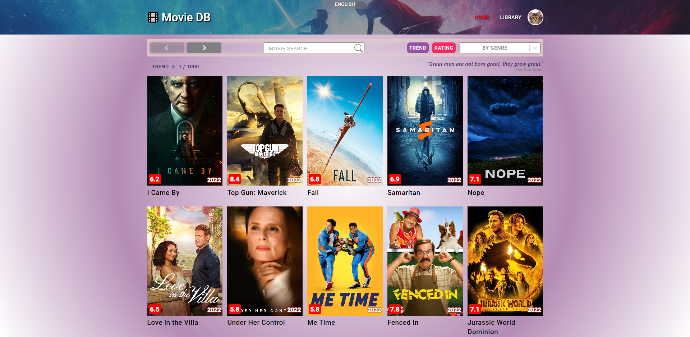
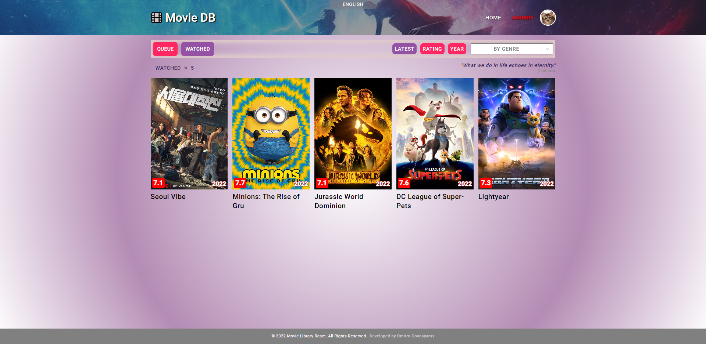
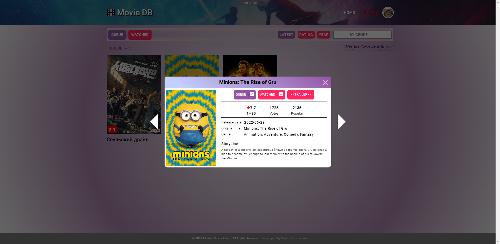
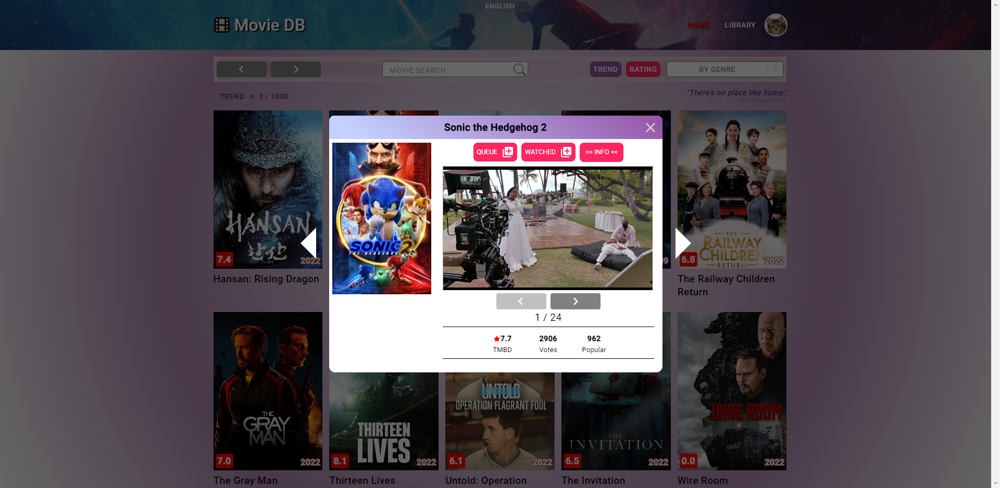
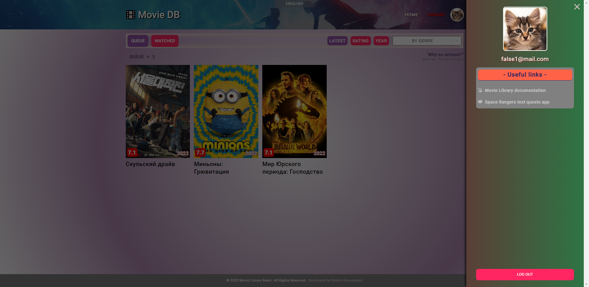
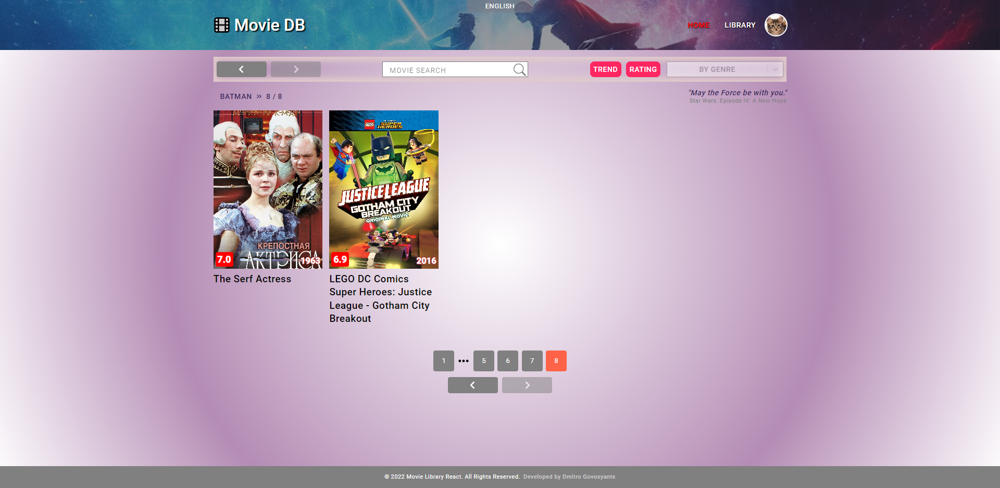

**Read documentation in other languages: [English](README.md)**

**Read deploy documentation: [Delpoy](README.deploy.md).**

# Movie Library DB. React.js.

## Сore functionality

- Просмотр подборки фильмов из базы TMDB
- Просмотр информации о фильме
- Просмотр тизеров и трейлеров фильма
- Сортировка по тренду и рейтингу
- Фильтрация по жанру
- Поиск фильма по названию
- Кастомная пагинация
- Кастомный свайп для мобильных устройств
- Локализация базы TMDB
- Пасхалка

## Authorization functionality

- Доступ к личной библиотеки фильмов
- Возможность добавления фильмов в списки "На просмотр" и "Просмотренные"
- Сортировка библиотеки по списку просмотра
- Сортировка библиотеки по последним добавленным, рейтингу и дате релиза
- Фильтрация библиотеки по жанру
- Меню пользователя

## UX/UI

- Сохранение запросов пользователя в адресной строке
- При переходе между страницами сохраняется история запросов
- Приватные и публичные маршруты
- Меню контроля состояния приложения вынесено в аккуратный блок
- Дополнительная пагинация в верхней части страницы
- "Хлебные крошки" для обзора текущего состояния приложения
- "Скелетон" списка фильмов при загрузке постеров
- Свайп карточек фильма на мобильных устройствах
- Переключение карточек фильмов на десктопных устройствах
- "Космический" лоадер при подгрузке контента
- Смена аватарок пользователя c сохранением в БД
- Всегда актуальный год существования приложения в футере

- Адаптивно-отзывчивый дизайн для всех устройств от 320px
- Всплывающие сообщения взаимодествия с пользователем
- Подобранный размер кнопок под разные экраны
- Читаемый текст для разных устройств
- Полезные ссылки в меню пользователя
- Фавиконы для разных устройств
- Дополнительные курсоры
- Мягкие градиенты и тени
- Локализация
- Цитаты из фильмов
- Пасхалка

## App view

## API

- Firebase auth
- Firebase Realtime DB
- TMDB DB

## Dependencies

- react
- react-router-dom
- react-hook-form
- react-select
- react-icons
- react-toastify
- react-loader-spinner
- react-transition-group
- @emotion
- axios
- firebase
- throttle-debounce
- modern-normalize
